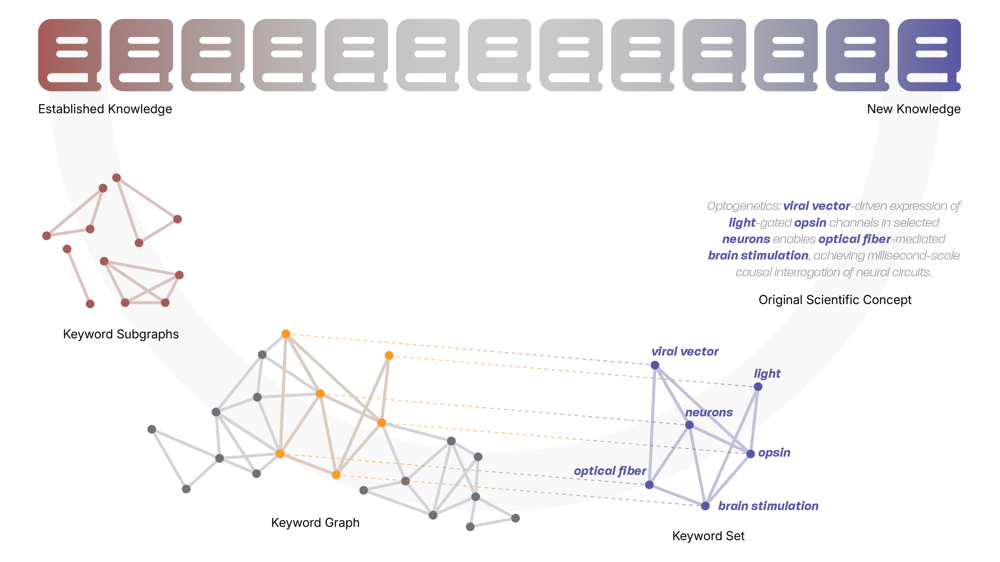

# Spacer: Towards Engineered Scientific Inspiration


<a href="https://www.asteromorph.com/research/spacer-towards-engineered-scientific-inspiration">
    </a>
<a href="https://www.asteromorph.com/news/engineering-scientific-inspiration-how-ai-drives-scientific-discovery-as-independent-architect">
    </a>
<br></br>




## Abstract

Recent advances in LLMs have made automated scientific research the next frontline in the path to artificial superintelligence. However, these systems are bound either to tasks of narrow scope or the limited creative capabilities of LLMs. We propose *Spacer*, a scientific discovery system that develops creative and factually grounded concepts without external intervention. *Spacer* attempts to achieve this via 'deliberate decontextualization,' an approach that disassembles information into atomic units—keywords—and draws creativity from unexplored connections between them. *Spacer* consists of (i) Nuri, an inspiration engine that builds keyword sets, and (ii) the Manifesting Pipeline that refines these sets into elaborate scientific statements. Nuri extracts novel, high-potential keyword sets from a keyword graph built with 180,000 academic publications in biological fields. The Manifesting Pipeline finds links between keywords, analyzes their logical structure, validates their plausibility, and ultimately drafts original scientific concepts. According to our experiments, the evaluation metric of Nuri accurately classifies high-impact publications with an AUROC score of 0.737. Our Manifesting Pipeline also successfully reconstructs core concepts from the latest top-journal articles solely from their keyword sets. An LLM-based scoring system estimates that this reconstruction was sound for over 85\% of the cases. Finally, our embedding space analysis shows that outputs from *Spacer* are significantly more similar to leading publications compared with those from SOTA LLMs.

## Contents

This repository contains the supplementary materials for the technical report *Spacer: Towards Engineered Scientific Inspiration*.

| Content | Description |
| ------- | ----------- |
| [`embeddings`](embeddings) | Style-normalized sentences from published papers and Statements (from *Spacer*). |
| [`reconstructing_papers`](reconstructing_papers) | Reconstructed concepts from published papers. |
| [`results`](results) | Statements from *Spacer*. |

## Citation
```bibtex
@misc{lee2025spacerengineeredscientificinspiration,
      title={Spacer: Towards Engineered Scientific Inspiration}, 
      author={Minhyeong Lee and Suyoung Hwang and Seunghyun Moon and Geonho Nah and Donghyun Koh and Youngjun Cho and Johyun Park and Hojin Yoo and Jiho Park and Haneul Choi and Sungbin Moon and Taehoon Hwang and Seungwon Kim and Jaeyeong Kim and Seongjun Kim and Juneau Jung},
      year={2025},
      eprint={2508.17661},
      archivePrefix={arXiv},
      primaryClass={cs.AI},
      url={https://arxiv.org/abs/2508.17661}, 
}
```
